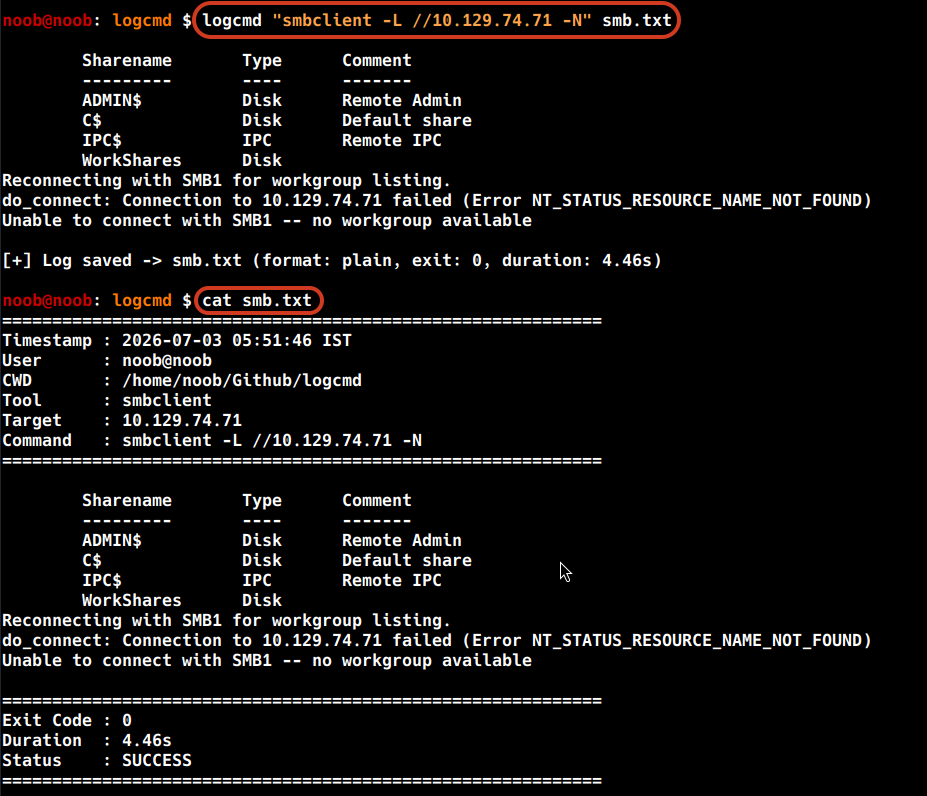
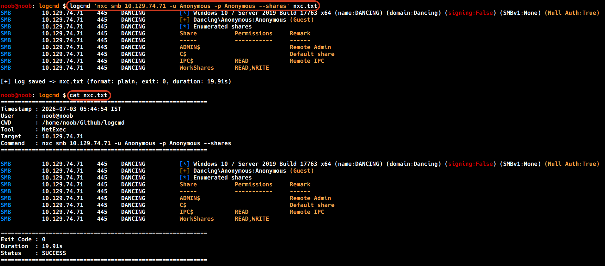
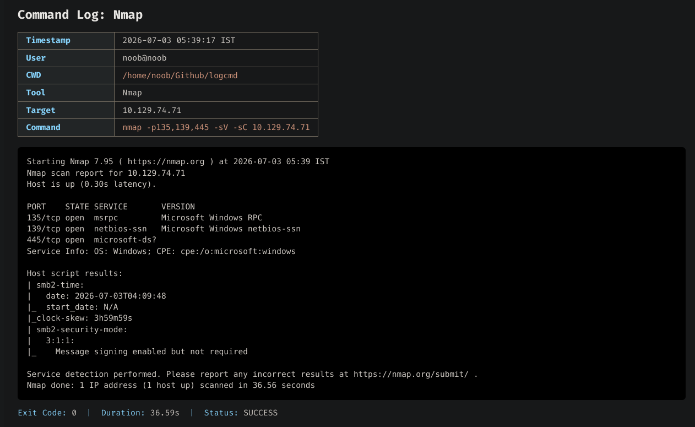

## Screenshots

### SMBClient

**Command**

```bash
logcmd "smbclient -L //<target> -N" smb.txt
```



---

### NetExec

**Command**

```bash
logcmd "nxc smb <target> -u Anonymous -p Anonymous --shares" nxc.txt
```



---

### HTML Output

**Command**

```bash
logcmd "nmap -p135,139,445 -sV -sC <target>" nmap.html --format html
```


